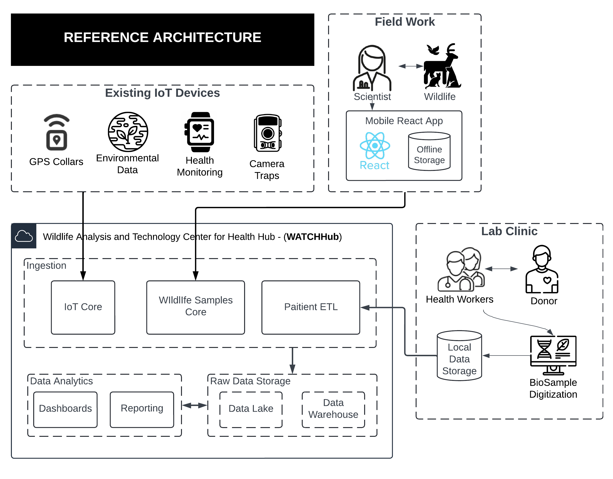

## 🚨 Portfolio Scenario: Responding to a Wildlife-Origin Virus Outbreak

This project is a **portfolio simulation**, designed to showcase how I would architect and implement a scalable, secure, AWS cloud-native solution in response to a **wildlife-origin virus outbreak** with potential human spillover.

It demonstrates my experience in:

- Creating clear architectural documentation and artifacts to communicate with dev teams, analysts, and leadership
- Understanding and modeling business cases (e.g., opt-in human health data coordination)
- Designing modular AWS infrastructure using the AWS Cloud Development Kit (CDK)
- Integrating IoT data collection with genomic analysis pipelines and cloud-scale data sharing
- Applying security best practices with AWS services (IAM, Secrets Manager, IoT Core certificates, fine-grained access policies)
- Structuring infrastructure as reusable, maintainable code across multiple stacks

Everything in this project is fictional but grounded in real-world architecture patterns used in health, government, and research cloud systems.

# Scenario: Wildlife Health Surveillance Cloud Solution (WATCH)

**Wildlife Health Surveillance (WHS) Program**, is a fictional program dedicated to monitoring and detecting pathogens affecting wildlife populations, which can potentially spill over to humans, posing a significant public health risk. To facilitate this work, the WHS Program requires a robust and scalable IT solution for the genomic analysis of wildlife samples, storage of genomic sequence data, and sharing of results with various stakeholders, including wildlife health organizations, research institutions, and public health agencies.

## 🧭 Architecture Overview

<p align="center">
  
</p>


---

## 🧪 Key Use Cases Identified from Architecture

<details>
  <summary>1️⃣ IoT-Based Wildlife Data Collection</summary>
  
  - **GPS Collars** on animals collect movement and geolocation data.
  - **Environmental Data Sensors** track climate, pollution, and habitat conditions.
  - **Health Monitoring Devices** collect biological and physiological data from wildlife.
  - **Camera Traps** capture visual data on wildlife presence and behaviors.
</details>

<details>
  <summary>2️⃣ Edge-to-Cloud Data Ingestion & Processing</summary>
  
  - **ECS IoT Cluster Containers** handle incoming sensor data streams.
  - **IoT Rules Engine** routes messages from IoT devices to AWS Lambda functions.
  - **Lambda Functions** process real-time sensor data (`GPSTopicProcessor.py`, `EnvTopicProcessor.py`, etc.).
  - **Raw data is categorized into separate processing layers** for GPS, environmental, health, and camera data.
</details>

<details>
  <summary>3️⃣ ETL Pipelines for Data Transformation & Storage</summary>
  
  - **Data is extracted, cleaned, and transformed** through specialized ETL functions (`GPS_ETL`, `Env_ETL`, `Hea_ETL`, etc.).
  - **Processed data is stored in Amazon S3** (acts as a structured data lake for analysis).
  - **ETL pipelines** enable structured storage of wildlife movement, health metrics, and environmental conditions.
</details>

<details>
  <summary>4️⃣ Integration with Off-Site Health Clinics & Research Labs</summary>
  
  - **Secure Direct Connect & On-Prem PostgreSQL Server** for data sharing.
  - **Clinic Staff & Researchers** access wildlife data to study potential pathogen spillover into human populations.
  - **On-premise clinic software & IoT health monitoring data exchange** ensure collaboration with public health organizations.
</details>

<details>
  <summary>5️⃣ Data Analytics & Visualization</summary>
  
  - **Metabase (BI Tool) provides dashboards and queries** for analyzing wildlife data.
  - **Analysts can query GPS movement trends, environmental changes, and wildlife health risks.**
  - **Historical & real-time insights support decision-making** for conservationists and epidemiologists.
</details>

---

## ⚙️ AWS Architecture (via CDK)

This solution is split across modular stacks:

| Stack | Purpose |
|-------|---------|
| `EcrStack` | Manages ECR repositories for IoT containers |
| `EcsStack` | Deploys ECS Fargate services for IoT telemetry publishing |
| `IotCodeStack` | Automates IoT Thing creation, policy assignment, cert management |
| `DataIngestionStack` | Handles ingestion pipelines |
| `DataAnalyticsStack` | Sets up batch compute environments for genomic analysis |
| `AuthStack` | Centralized authentication and role management |
| `AmplifyStack` | Front-end hosting for UI and dashboards |

---

## 🔐 Security Features

- Secure secrets storage using AWS Secrets Manager
- Fine-grained IAM roles for ECS tasks
- Automated IoT cert/key management
- Role-based access to genomic data

---

## 📦 Tech Stack

- **AWS CDK** (TypeScript)
- **ECR, ECS, IoT Core, Secrets Manager, CloudWatch**
- **Python + Linux environments for genomics**
- **Amplify + Auth (optional frontend)**

---

## 📁 Repo Structure

```bash
├── lib/
│   ├── iot/
│   │   ├── ecr-stack.ts
│   │   ├── ecs-stack.ts
│   │   ├── iot-stack.ts
│   │   └── helpers/
│   │       ├── ecs-factory.ts
│   │       └── iot-factory.ts
│   └── platform/
│       ├── data-ingestion-stack.ts
│       ├── data-analytics-stack.ts
│       ├── auth-stack.ts
│       └── amplify-stack.ts
├── bin/
│   └── cdk.ts
├── README.md
└── cdk.json
```

---

## 🚀 Deployment

1. Install dependencies:
   ```bash
   npm install
   ```

2. Bootstrap the CDK environment:
   ```bash
   cdk bootstrap
   ```

3. Deploy:
   ```bash
   cdk deploy --all
   ```

---

## 🧰 Admin Roles

- **Cloud Architect & Lead:** Oversees design and deployment
- **Data Management Lead:** Manages genomic data pipelines and compliance

---

## 📎 Resources

- [📘 Design Doc (PDF)](link-to-pdf)
- [📖 Blog: Deploying IoT Genomics with AWS CDK](your-blog-link)
- [📊 Live Demo (if applicable)](link)

---

## 📜 License

MIT
